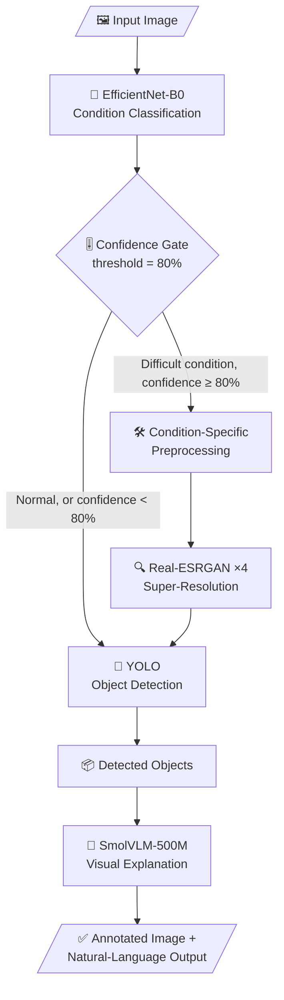

🌦️ Smart Vision — Condition-Aware Object Detection

# 🌦️ Smart Vision — Condition-Aware Object Detection

<p align="center">
  
</p>

<p align="center">
  <b>Look at the weather first. Then decide how to see.</b><br>
  An adaptive computer-vision pipeline that classifies the environmental condition of an image and only enhances it when it actually needs it.
</p>

<p align="center">
  
  
  
  
  
  
  
</p>

---

## 💡 The Idea

Most detection pipelines treat every image the same: enhance everything, or enhance nothing. Both waste something. Enhancing a clear image can add artifacts and compute cost. Skipping enhancement on a foggy or dark image throws away recoverable detail.

**Smart Vision routes each image based on what it actually looks like.**

> **Understand the environment first, then adapt the vision pipeline.**

### What makes it different

| Typical pipeline | Smart Vision |
|---|---|
| Same preprocessing for every image | Preprocessing chosen per detected condition |
| Always enhance, or never enhance | **Confidence gate** skips enhancement when the model is unsure or the scene is normal |
| Output is boxes and labels only | Adds a **natural-language explanation** of how conditions affect visibility |
| Monolithic script | Modular stages (`classifier`, `gate`, `enhancers`, `detector`, `vlm`) that can be swapped independently |
| Hard-coded settings | Everything tunable from a single `config.json` |

### Supported conditions

| Condition | Handling |
|---|---|
| 🌫️ Fog | Visibility enhancement |
| 🌙 Low-Light | Gamma / contrast enhancement |
| 🌧️ Rain | Rain-streak processing |
| ❄️ Snow | Contrast / enhancement |
| 🏜️ Sand-Dust | Contrast / enhancement |
| ☀️ Normal | Original image kept, no enhancement |

### Good fit for

🚗 Road-scene understanding · 🚦 Intelligent transportation research · 🌧️ Adverse-weather vision · 🤖 Adaptive CV experiments

---

## 🧩 How It Works



### Stage by stage

**1. Condition classification.** The image is resized to 224 × 224, ImageNet-normalized, and passed to EfficientNet-B0, which returns one of six conditions plus a confidence score.

**2. Confidence gate.** The gate is what keeps the pipeline from over-processing.

| Prediction | Confidence | Action |
|---|---|---|
| Normal | ≥ 80% | Original image goes straight to detection |
| Fog / Low-Light / Rain / Snow / Sand-Dust | ≥ 80% | Enhancement pipeline |
| Any | < 80% | Fallback: original image (uncertain predictions never trigger processing) |

**3. Condition-specific enhancement.** Each condition has its own preprocessing routine in `pipeline/enhancers.py`.

**4. Real-ESRGAN.** Processed images can be upscaled ×4 before detection to recover fine detail for small objects.

**5. YOLO detection.** Supports YOLOv8s, YOLO11s and YOLO26s weights. Switch models from `config.json` or the command line.

**6. SmolVLM explanation.** SmolVLM-500M-Instruct receives the image and detection context and writes a short explanation covering:
1. The environmental condition
2. The main detected objects
3. How the condition affects visibility and detection

The explanation is generated by the vision-language model from the image and detections; there is no separate Grad-CAM/XAI module.

---

## 📊 Results

### Environmental condition classifier

| Model | Test Accuracy | Precision | Recall | F1 |
|---|---:|---:|---:|---:|
| ResNet-18 | 81.75% | 83.08 | 81.75 | 81.23 |
| **EfficientNet-B0** ✅ | **83.33%** | **83.31** | **83.33** | **83.10** |

EfficientNet-B0 was chosen for the final pipeline: higher accuracy with substantially fewer parameters than ResNet-18.

### YOLO benchmark (YOLO26s, clean setting)

| Metric | Score |
|---|---:|
| Precision | 86.49% |
| Recall | 57.86% |
| mAP@50 | 70.21% |
| mAP@50–95 | 43.44% |

> Precision is high while recall is moderate: the detector is conservative and misses some objects. Results vary with dataset split, preprocessing, confidence threshold, model weights and hardware.

<!-- TIP: add a before/after gallery here (original vs enhanced vs detections for each condition). Visual proof is the strongest part of any CV README.
<p align="center"></p>
-->

---

## 🗂️ Project Structure

```text
smart-vision-condition-aware-yolo/
├── config.json              # all pipeline settings
├── inference.py             # CLI entry point
├── requirements.txt
├── README.md
│
├── pipeline/
│   ├── classifier.py        # EfficientNet-B0 condition classifier
│   ├── gate.py              # confidence-gate logic
│   ├── enhancers.py         # per-condition preprocessing
│   ├── detector.py          # YOLO wrapper
│   ├── vlm.py               # SmolVLM explanation
│   └── runner.py            # orchestrates the full pipeline
│
├── models/
│   ├── classifier.pth
│   ├── yolo11s.pt
│   └── RealESRGAN_x4plus.pth
│
├── samples/                 # test images
└── results/
    ├── processed_input.jpg
    ├── esrgan_output.jpg
    ├── detection_results.csv
    └── classifier_results.csv
```

> Large model weights are usually excluded from GitHub. Download them and place them in `models/` according to your configuration.

---

## 🚀 Quick Start

### 1. Clone

```bash
git clone https://github.com/JANANI-RS06/smart-vision-condition-aware-yolo.git
cd smart-vision-condition-aware-yolo
```

### 2. Create a virtual environment

```bash
# Windows
python -m venv venv
venv\Scripts\activate

# Linux / macOS
python3 -m venv venv
source venv/bin/activate
```

### 3. Install dependencies

```bash
pip install -r requirements.txt
```

### 4. Add model weights

Place `classifier.pth`, your YOLO weights and `RealESRGAN_x4plus.pth` inside `models/`.

### 5. Run inference

```bash
python inference.py "samples/image1.jpg"

# choose a different YOLO model
python inference.py "samples/image1.jpg" yolo11s
```

Each run reports: condition, confidence, gate decision, preprocessing status, ESRGAN status, detected objects, VLM explanation and inference time. Output images and CSVs are saved to `results/`.

### Example output

```text
Condition      : Fog
Confidence     : 92.4%

Gate Decision  : PROCESSING APPLIED
Processing     : Fog enhancement
ESRGAN         : Applied

Detected       : car, truck, person

VLM Explanation:
The fog reduces visibility around the vehicles and person,
which can make object detection more challenging.
```

---

## ⚙️ Configuration

Everything lives in `config.json`:

```json
{
  "classes": ["Fog", "Low-Light", "Normal", "Rain", "Sand-Dust", "Snow"],
  "confidence_threshold": 0.8,
  "classifier": { "arch": "efficientnet_b0", "input_size": 224 },
  "detector": { "name": "YOLO11s", "conf": 0.25, "iou": 0.45, "imgsz": 640 },
  "vlm": { "enabled": true, "model": "HuggingFaceTB/SmolVLM-500M-Instruct" }
}
```

| Setting | What it controls |
|---|---|
| `confidence_threshold` | Gate strictness. Higher means fewer images enhanced, lower means more |
| `detector.conf` / `iou` | YOLO confidence and NMS thresholds |
| `detector.imgsz` | Detection input size |
| `vlm.enabled` | Set `false` to skip explanations and run faster |

---

## 🧰 Technology Stack

| Area | Technology |
|---|---|
| Language | Python |
| Deep learning | PyTorch |
| Condition classifier | EfficientNet-B0 |
| Image processing | OpenCV, NumPy, Pillow |
| Super-resolution | Real-ESRGAN |
| Object detection | Ultralytics YOLO |
| Vision-language model | SmolVLM-500M-Instruct |
| Data handling | Pandas |
| Visualization | Matplotlib |

---

## ⚠️ Limitations

Being upfront about where the project stands:

- The classifier reaches 83.33% test accuracy, so some images will be misrouted. The 80% gate reduces, but does not remove, that risk.
- The dataset is limited in size and diversity; performance may drop on unseen cameras, regions or mixed conditions (for example fog at night).
- Real-ESRGAN ×4 is computationally heavy and noticeably slows inference without a GPU.
- Detection recall (57.86%) shows that small or partly hidden objects are still missed.
- SmolVLM explanations are descriptive and may occasionally be generic or inaccurate; they are not a rigorous attribution method.

---

## 🔮 Roadmap

- [ ] Expand the adverse-weather dataset and add mixed-condition samples
- [ ] Fine-tune the detector on weather-specific scenes
- [ ] Ablation study: no processing vs. enhancement only vs. enhancement + ESRGAN
- [ ] Optimize Real-ESRGAN inference speed
- [ ] Batch and video inference
- [ ] Compare YOLO variants systematically
- [ ] Automated evaluation reports
- [ ] Deploy as an API

---

## 🤝 Contributing

Issues and pull requests are welcome. For larger changes, open an issue first to discuss the idea.

---

## ⭐ Acknowledgements

Built on open-source work from PyTorch, Ultralytics YOLO, Real-ESRGAN and Hugging Face SmolVLM. If the project helps you, consider giving the repository a ⭐.

## 📄 License

Intended for academic and research purposes. See the repository license for usage details.
